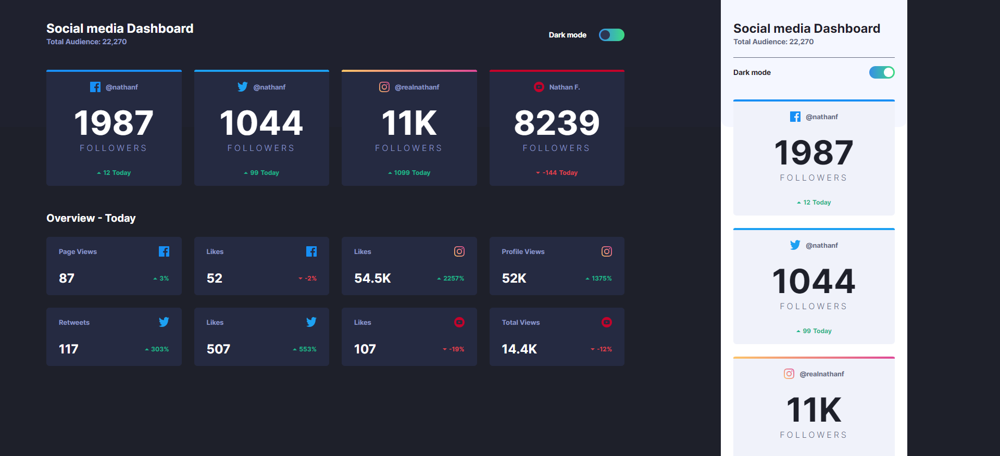

# Frontend Mentor - Social media dashboard with theme switcher solution

This is a solution to the [Social media dashboard with theme switcher challenge on Frontend Mentor](https://www.frontendmentor.io/challenges/social-media-dashboard-with-theme-switcher-6oY8ozp_H). Frontend Mentor challenges help you improve your coding skills by building realistic projects.

## Table of contents

- [Overview](#overview)
  - [The challenge](#the-challenge)
  - [Screenshot](#screenshot)
  - [Links](#links)
- [My process](#my-process)
  - [Built with](#built-with)
  - [What I learned](#what-i-learned)
- [Author](#author)

## Overview

### The challenge

Users should be able to:

- View the optimal layout for the site depending on their device's screen size
- See hover states for all interactive elements on the page
- Toggle color theme to their preference

### Screenshot



### Links

- Solution URL: [https://github.com/grzeg95/social-media-dashboard-with-theme-switcher-master/](https://github.com/grzeg95/social-media-dashboard-with-theme-switcher-master/)
- Live Site URL: [https://soc-med-dashb-wi-theme-swit-ma.web.app/](https://soc-med-dashb-wi-theme-swit-ma.web.app/)

## My process

### Built with

- Firebase hosting:github
- [Angular 17](https://angular.dev/)
- Angular unit tests
- SASS Theme
- CSS Grid, BEM
- Mobile-first workflow

### What I learned

- Creating Angular custom theme for components

```scss
.light {
  @include container($light-theme);
  @include app-root($light-theme);
  @include app-audience-card($light-theme);
  @include app-statistic-event-card($light-theme);
  @include app-switch($light-theme);
  @include hr($light-theme);
}

.dark {
  @include container($dark-theme);
  @include app-root($dark-theme);
  @include app-audience-card($dark-theme);
  @include app-statistic-event-card($dark-theme);
  @include app-switch($dark-theme);
  @include hr($dark-theme);
}
```

- Creating Angular library with module and provide

```ts
export class ThemeSelectorModule {
  static forRoot(config: Config): ModuleWithProviders<ThemeSelectorModule> {
```

```ts
export function provideThemeSelector(config: Config): EnvironmentProviders {
  return makeEnvironmentProviders([
```

- Testing Angular service

```ts
describe('ThemeSelectorService', () => {
  let service: ThemeSelectorService;
```

- Testing Angular service on GitHub Actions [karma.conf.js]

```js
customLaunchers: {
  ChromeHeadlessCustom: {
    base: 'ChromeHeadless',
    flags: ['--no-sandbox', '--disable-gpu']
  }
},
```

- Linting Angular with eslint

```bash
ng add @angular-eslint/schematics
```

## Author

- Frontend Mentor - [@grzeg95](https://www.frontendmentor.io/profile/grzeg95/)
